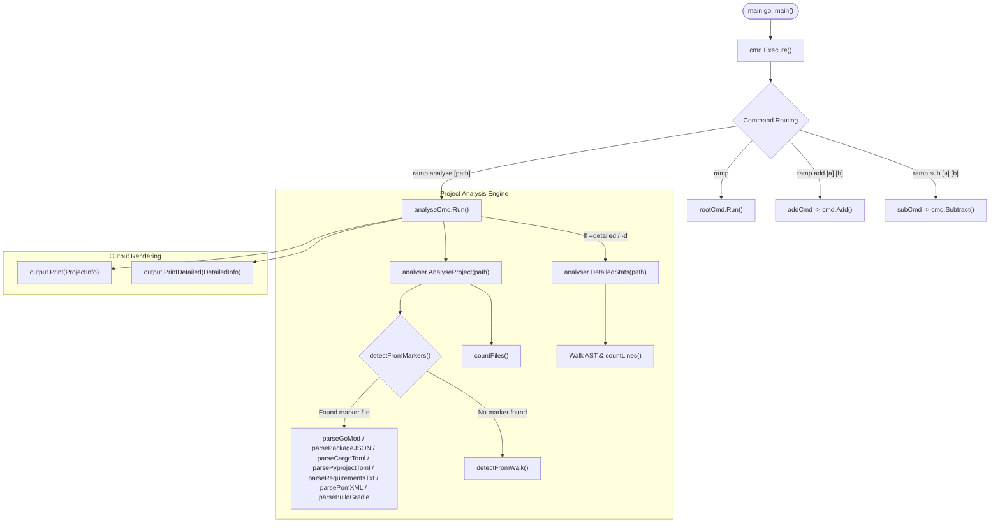

# GoRamp Handoff Document

This document provides a concise yet comprehensive technical handoff of the **GoRamp** codebase, covering the architectural structure, end-to-end execution flow, and a breakdown of every file, function, variable, data model, and error handling behavior.

---

## 1. Project Overview & Architecture

**GoRamp** (`github.com/RVS-30/ramp`) is a Go CLI application built on [Cobra](https://github.com/spf13/cobra) and styled with [Lip Gloss](https://github.com/charmbracelet/lipgloss).

The application provides two main feature sets:
1. **Project Analyzer (`analyse`)**: Inspects any directory (or current working directory), detects project name, language ecosystem, primary framework, runtime/language version, and file/line statistics using marker detection and recursive directory walking.
2. **Calculator Utilities (`add`, `sub`)**: CLI commands for basic floating-point arithmetic.



---

## 2. Directory Structure

```
GoRamp/
├── main.go                       # Application entry point
├── cmd/                          # CLI commands and UI templates (Cobra)
│   ├── root.go                   # Root command, Lip Gloss styling & custom help template
│   ├── analyse.go                # 'analyse' subcommand
│   ├── add.go                    # 'add' subcommand
│   ├── sub.go                    # 'sub' subcommand
│   └── ramp.go                   # Calculator logic (Add & Subtract functions)
├── internal/
│   ├── analyser/                 # Project inspection & dependency analysis engine
│   │   ├── analyser.go           # Core analysis entry point & ProjectInfo struct
│   │   ├── marker.go             # Marker-file dispatching
│   │   ├── walk.go               # Directory walking, file count & language heuristic
│   │   ├── detailed.go           # Line-by-line stats and per-language metrics
│   │   ├── gomod.go              # go.mod parser
│   │   ├── packagejson.go        # package.json parser (JS/TS)
│   │   ├── cargotoml.go          # Cargo.toml parser (Rust)
│   │   ├── pyprojecttoml.go      # pyproject.toml parser (Python)
│   │   ├── requirementstxt.go    # requirements.txt parser (Python)
│   │   ├── parsepomxml.go        # pom.xml parser (Java)
│   │   └── parsebuildgradle.go   # build.gradle parser (Java/Kotlin)
│   └── output/                   # Terminal formatting & Lip Gloss presentation
│       └── output.go             # Print and PrintDetailed formatters
├── go.mod                        # Go module definition & dependencies
└── go.sum                        # Checksums for Go dependencies
```

---

## 3. Detailed Component Breakdown

### 3.1 Entry Point & CLI Commands (`cmd/`)

#### [`main.go`](file:///Users/fwc-6cyv/Projects/GoRamp/main.go)
- [main()](file:///Users/fwc-6cyv/Projects/GoRamp/main.go#L9-L11): Calls [cmd.Execute()](file:///Users/fwc-6cyv/Projects/GoRamp/cmd/root.go#L87-L93).

#### [`cmd/root.go`](file:///Users/fwc-6cyv/Projects/GoRamp/cmd/root.go)
- **Variables**:
  - `rootCmd`: Top-level `*cobra.Command` configured with version `1.0.0`.
  - `headingStyle`, `subHeadingStyle`, `usageStyle`, `descriptionStyle`: Lip Gloss styles configuring colors (pink ANSI 205, cyan ANSI 86, orange ANSI 214) and bolding.
  - `customHelpTemplate`: Cobra template string for formatted help and usage outputs.
- **Functions**:
  - [hasNonHelpFlags(cmd *cobra.Command) bool](file:///Users/fwc-6cyv/Projects/GoRamp/cmd/root.go#L46-L58): Inspects local flags on `cmd` and returns `true` if any non-`help` flag exists.
  - [nonFlagsUsage(cmd *cobra.Command) string](file:///Users/fwc-6cyv/Projects/GoRamp/cmd/root.go#L60-L68): Extracts command arguments from `cmd.Use`.
  - [Execute()](file:///Users/fwc-6cyv/Projects/GoRamp/cmd/root.go#L87-L93): Runs `rootCmd.Execute()`. If an error occurs, prints to `os.Stderr` and terminates with `os.Exit(1)`.
  - [init()](file:///Users/fwc-6cyv/Projects/GoRamp/cmd/root.go#L95-L163): Registers custom template functions (`heading`, `subHeading`, `usage`, `description`, `HasNonHelpFlags`, `NonFlagsUsage`, `usageLine`) and binds `customHelpTemplate` to `rootCmd`.

#### [`cmd/analyse.go`](file:///Users/fwc-6cyv/Projects/GoRamp/cmd/analyse.go)
- **Variables**:
  - `detailedFlag bool`: Bound to `--detailed` / `-d` flag.
  - `analyseCmd`: Command definition accepting `[path]` (defaults to `.` if no arg is given; capped at `cobra.MaximumNArgs(1)`).
- **Execution Flow**:
  1. Calls [analyser.AnalyseProject(root)](file:///Users/fwc-6cyv/Projects/GoRamp/internal/analyser/analyser.go#L14-L20). Prints error and returns on failure.
  2. Calls [output.Print(info)](file:///Users/fwc-6cyv/Projects/GoRamp/internal/output/output.go#L29-L52).
  3. If `detailedFlag` is `true`, calls [analyser.DetailedStats(root)](file:///Users/fwc-6cyv/Projects/GoRamp/internal/analyser/detailed.go#L63-L114) and [output.PrintDetailed(detail)](file:///Users/fwc-6cyv/Projects/GoRamp/internal/output/output.go#L56-L85).

#### [`cmd/add.go`](file:///Users/fwc-6cyv/Projects/GoRamp/cmd/add.go) & [`cmd/sub.go`](file:///Users/fwc-6cyv/Projects/GoRamp/cmd/sub.go)
- `addCmd` / `subCmd`: Cobra commands configured with `DisableFlagParsing: true` and `Args: cobra.ExactArgs(2)`.
- Invokes [cmd.Add()](file:///Users/fwc-6cyv/Projects/GoRamp/cmd/ramp.go#L8-L22) and [cmd.Subtract()](file:///Users/fwc-6cyv/Projects/GoRamp/cmd/ramp.go#L24-L38) with positional string arguments.

#### [`cmd/ramp.go`](file:///Users/fwc-6cyv/Projects/GoRamp/cmd/ramp.go)
- [Add(first, second string) string](file:///Users/fwc-6cyv/Projects/GoRamp/cmd/ramp.go#L8-L22): Parses inputs via `strconv.ParseFloat(..., 64)`. On parse error, logs to stdout and returns `"cannot be performed"`. Returns sum formatted with `%f`.
- [Subtract(first, second string) string](file:///Users/fwc-6cyv/Projects/GoRamp/cmd/ramp.go#L24-L38): Parses inputs via `strconv.ParseFloat(..., 64)`. On parse error, logs to stdout and returns `""`. Returns difference formatted with `%f`.

---

### 3.2 Analysis Engine (`internal/analyser/`)

#### [`internal/analyser/analyser.go`](file:///Users/fwc-6cyv/Projects/GoRamp/internal/analyser/analyser.go)
- **Struct**:
  - `ProjectInfo`: `{ Name, Language, Framework, Version string, FileCount int }`
- **Functions**:
  - [AnalyseProject(root string) (*ProjectInfo, error)](file:///Users/fwc-6cyv/Projects/GoRamp/internal/analyser/analyser.go#L14-L20): Attempts marker detection first via [detectFromMarkers(root)](file:///Users/fwc-6cyv/Projects/GoRamp/internal/analyser/marker.go#L26-L59). If matched, populates `FileCount` via [countFiles(root)](file:///Users/fwc-6cyv/Projects/GoRamp/internal/analyser/walk.go#L49-L65). If no marker matched, falls back to [detectFromWalk(root)](file:///Users/fwc-6cyv/Projects/GoRamp/internal/analyser/walk.go#L67-L104).
  - [absOrRoot(root string) string](file:///Users/fwc-6cyv/Projects/GoRamp/internal/analyser/analyser.go#L23-L29): Converts `root` to absolute path; falls back to raw string on error.

#### [`internal/analyser/marker.go`](file:///Users/fwc-6cyv/Projects/GoRamp/internal/analyser/marker.go)
- **Structs & Variables**:
  - `marker`: `{ file, language string }`
  - `markers`: Ordered list of root marker files: `go.mod`, `Cargo.toml`, `package.json`, `pyproject.toml`, `requirements.txt`, `pom.xml`, `build.gradle`, `Gemfile`, `composer.json`.
- **Functions**:
  - [detectFromMarkers(root string) (*ProjectInfo, bool)](file:///Users/fwc-6cyv/Projects/GoRamp/internal/analyser/marker.go#L26-L59): Iterates over `markers`. If `os.ReadFile(filepath.Join(root, m.file))` succeeds, initializes `ProjectInfo{Language: m.language}`, invokes the corresponding manifest parser, defaults `info.Name` to the directory name if unset, and returns `(info, true)`.

#### [`internal/analyser/walk.go`](file:///Users/fwc-6cyv/Projects/GoRamp/internal/analyser/walk.go)
- **Variables**:
  - `skipDirs`: Ignored directory names (`.git`, `node_modules`, `vendor`, `.venv`, `venv`, `__pycache__`, `dist`, `build`, `target`, `.idea`, `.vscode`, `bin`, `obj`, etc.).
  - `extToLang`: Map of primary file extensions (`.go`, `.py`, `.js`, `.ts`, `.java`, `.cpp`, `.c`, `.rb`, `.php`, `.rs`, `.swift`, `.cs`, etc.) to language names.
- **Functions**:
  - [countFiles(root string) int](file:///Users/fwc-6cyv/Projects/GoRamp/internal/analyser/walk.go#L49-L65): Walks directory tree skipping `skipDirs` and unreadable entries, returning total file count.
  - [detectFromWalk(root string) (*ProjectInfo, error)](file:///Users/fwc-6cyv/Projects/GoRamp/internal/analyser/walk.go#L67-L104): Traverses directory tree counting total files and matching extensions against `extToLang`. Identifies the dominant language by highest file frequency.

#### [`internal/analyser/detailed.go`](file:///Users/fwc-6cyv/Projects/GoRamp/internal/analyser/detailed.go)
- **Structs & Variables**:
  - `detailedExtToLang`: Extends `extToLang` with documentation/config/web formats (`.md`, `.yaml`, `.yml`, `.json`, `.html`, `.css`, `.scss`, `.sh`, `.sql`, `.toml`, `.xml`).
  - `LangStat`: `{ Name string, Files int, Lines int }`
  - `DetailedInfo`: `{ Languages []LangStat, TotalFiles int, TotalLines int }`
- **Functions**:
  - [DetailedStats(root string) (*DetailedInfo, error)](file:///Users/fwc-6cyv/Projects/GoRamp/internal/analyser/detailed.go#L63-L114): Walks directory tree, counts lines for recognized file extensions via `countLines`, aggregates per-language stats, sorts languages in descending order by line count, and returns `*DetailedInfo`.
  - [countLines(path string) int](file:///Users/fwc-6cyv/Projects/GoRamp/internal/analyser/detailed.go#L119-L134): Efficiently streams lines using `bufio.Scanner` with a 1MB buffer capacity. Returns `0` if opening fails.

---

### 3.3 Manifest Parsers (`internal/analyser/`)

| Parser File | Target Ecosystem | Parsing Mechanism | Extracted Metadata |
| :--- | :--- | :--- | :--- |
| [`gomod.go`](file:///Users/fwc-6cyv/Projects/GoRamp/internal/analyser/gomod.go) | **Go** | `golang.org/x/mod/modfile` | • **Name**: Base path of module<br>• **Version**: `"Go " + go_version`<br>• **Framework**: Matched against `frameworkMarkers` (e.g. Gin, Echo, Fiber, Cobra, Bubble Tea, GORM) prioritized by `frameworkPriority` |
| [`packagejson.go`](file:///Users/fwc-6cyv/Projects/GoRamp/internal/analyser/packagejson.go) | **JavaScript / TypeScript** | `encoding/json` (`packageJSON` struct) | • **Name**: `name` field<br>• **Version**: `"Node " + engines.node`<br>• **Framework**: Matched against `jsFrameworkMarkers` (Next.js, React, Vue, Express, NestJS) then `jsToolingMarkers` (Vite, Webpack, Vitest) via [matchFramework()](file:///Users/fwc-6cyv/Projects/GoRamp/internal/analyser/packagejson.go#L97-L111) |
| [`cargotoml.go`](file:///Users/fwc-6cyv/Projects/GoRamp/internal/analyser/cargotoml.go) | **Rust** | `BurntSushi/toml` (`cargoToml` struct) | • **Name**: `package.name`<br>• **Version**: `"Rust " + edition + " edition"`<br>• **Framework**: Matched against `rustFrameworkMarkers` (Actix Web, Axum, Rocket, Tokio, Clap) then `rustToolingMarkers` (Criterion, Proptest) |
| [`pyprojecttoml.go`](file:///Users/fwc-6cyv/Projects/GoRamp/internal/analyser/pyprojecttoml.go) | **Python** (PEP 621 & Poetry) | `BurntSushi/toml` (`pyprojectToml` struct) | • **Name**: `project.name` or `tool.poetry.name`<br>• **Version**: `"Python " + requires-python`<br>• **Framework**: Normalized via [pyPackageName()](file:///Users/fwc-6cyv/Projects/GoRamp/internal/analyser/pyprojecttoml.go#L102-L110) against `pyFrameworkMarkers` (Django, Flask, FastAPI, PyTorch, Click) then `pyToolingMarkers` (pytest, tox) |
| [`requirementstxt.go`](file:///Users/fwc-6cyv/Projects/GoRamp/internal/analyser/requirementstxt.go) | **Python** (pip) | Line-by-line string scanner | • **Framework**: Strips comments, `-r`, and pip flags, matches dependencies via `pyPackageName()`<br>• *(Name/Version left empty to fall back to directory name)* |
| [`parsepomxml.go`](file:///Users/fwc-6cyv/Projects/GoRamp/internal/analyser/parsepomxml.go) | **Java** (Maven) | `encoding/xml` (`pomXML` struct) | • **Name**: `artifactId`<br>• **Version**: `"Java " + java.version`<br>• **Framework**: Matched against `javaFrameworkMarkers` (Spring Boot, Spring MVC, Quarkus, Hibernate) then `javaToolingMarkers` (JUnit, Mockito) |
| [`parsebuildgradle.go`](file:///Users/fwc-6cyv/Projects/GoRamp/internal/analyser/parsebuildgradle.go) | **Java / Kotlin** (Gradle) | Regex `['"]([a-zA-Z0-9_.\-]+):([a-zA-Z0-9_.\-]+)` | • **Framework**: Regex captures artifact IDs and matches against `javaFrameworkMarkers` and `javaToolingMarkers`<br>• *(Name left empty to fall back to directory name)* |

---

### 3.4 Presentation Layer (`internal/output/`)

#### [`internal/output/output.go`](file:///Users/fwc-6cyv/Projects/GoRamp/internal/output/output.go)
- **Styles**:
  - `labelStyle`: Grey (ANSI 245), fixed width 11 chars.
  - `valueStyle`: Bold.
  - `emptyStyle`: Dim grey (ANSI 240), italic (renders `—` for empty/zero fields).
  - `sectionHeaderStyle`: Grey (ANSI 245), bold.
  - `langNameStyle`: Fixed width 12 chars.
  - `percentStyle`: Yellow (ANSI 220).
- **Functions**:
  - [Print(info *analyser.ProjectInfo)](file:///Users/fwc-6cyv/Projects/GoRamp/internal/output/output.go#L29-L52): Formats and prints aligned key-value pairs:
    ```text
    Project    ramp
    Language   Go
    Framework  Cobra
    Version    Go 1.26.4
    Files      17
    ```
  - [PrintDetailed(info *analyser.DetailedInfo)](file:///Users/fwc-6cyv/Projects/GoRamp/internal/output/output.go#L56-L85): Computes line percentage per language and prints the detailed breakdown:
    ```text
    Languages:
      Go            82.4%
      Markdown      17.6%

    Files      17
    Lines      892
    ```

---

## 4. Error Handling & Edge Cases Summary

1. **Manifest File Unreadable / Missing**: Silently skipped in `detectFromMarkers`, falls back to subsequent markers or `detectFromWalk`.
2. **Malformed Manifest Files** (corrupt JSON, TOML, XML, or `go.mod` syntax): Parsing errors return early without mutating `info`; caller safely falls back to directory name and walk heuristics.
3. **Unreadable Files / Permission Issues**: `filepath.Walk` callbacks in `countFiles` and `DetailedStats` return `nil` to skip unreadable files rather than aborting the scan.
4. **Division by Zero**: `DetailedStats` guards percentage calculation with `if info.TotalLines > 0`.
5. **Arithmetic Parsing**: `strconv.ParseFloat` errors in `Add` and `Subtract` print an error message and return fallback values (`"cannot be performed"` and `""`).
